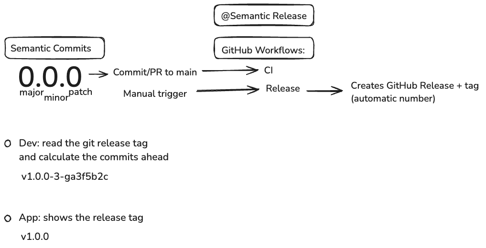

# semver

Reference implementation for semantic versioning and automated releases.



## Workflow

```
feature branch → PR → main (CI runs) → manual trigger → semantic-release → GitHub Release
```

## Commit Convention

| Prefix | Version Bump | Example |
|--------|-------------|---------|
| `fix:` | Patch | `fix: resolve login redirect` |
| `feat:` | Minor | `feat: add dark mode toggle` |
| `feat!:` | Major | `feat!: redesign auth flow` |

Other prefixes (`docs:`, `chore:`, `ci:`, `refactor:`, `test:`) do not trigger a release.

## GitHub Actions

### 1. CI (`ci.yml`)

Runs on push to `main` and on PRs. Installs deps, runs tests, runs build. No release.

### 2. Release (`release.yml`)

Triggered manually from the Actions tab. Runs semantic-release which:
- Analyzes commits since last tag
- Creates git tag + GitHub Release with changelog

No commits back to `main`. No `git pull` needed.

## Reading the Version in Your App

The version lives in git tags, not `package.json`. To access it at build time (e.g. in SvelteKit):

```ts
// vite.config.ts
import { execSync } from 'child_process';

const version = execSync('git describe --tags --abbrev=0 2>/dev/null || echo "v0.0.0"')
  .toString().trim().replace('v', '');

export default defineConfig({
  define: { __APP_VERSION__: JSON.stringify(version) }
});
```

In dev, `git describe` shows how far you are from the last release:

```bash
git describe --tags --always
# → v1.2.3-7-gabcdef1  (7 commits ahead of v1.2.3)
```

## Setup for a New Project

### 1. Install

```bash
bun add -D semantic-release
```

### 2. Copy files

- `.releaserc.json`
- `.github/workflows/ci.yml`
- `.github/workflows/release.yml`

### 3. Repository settings

**Settings → Actions → General → Workflow permissions → Read and write permissions**
