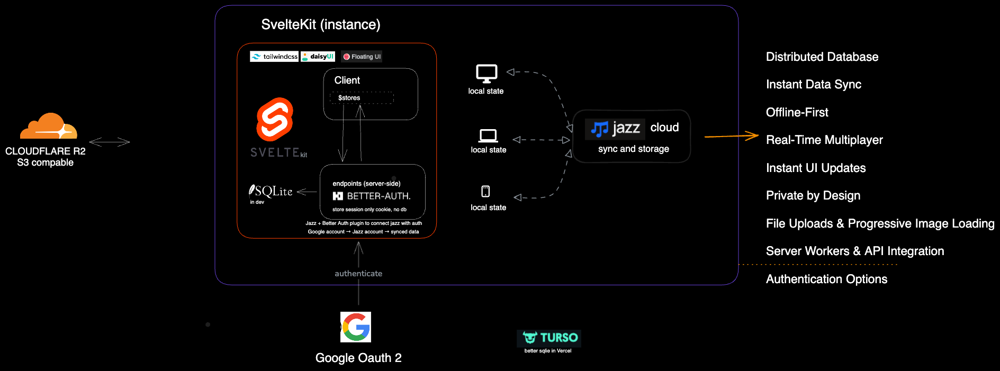

# Top Svelte Jazz Todo

A production-ready SvelteKit todo application with **Jazz.tools** for real-time sync and **Better Auth** for Google OAuth.


## Tech Stack


| Technology | Purpose |
|------------|---------|
| **SvelteKit 2** | Full-stack framework |
| **Svelte 5** | UI with runes (`$state`, `$derived`, `$effect`) |
| **Jazz.tools** | Real-time sync, offline-first, end-to-end encryption |
| **Better Auth** | Google OAuth authentication |
| **SQLite** | Local auth database (dev) |
| **Turso** | Cloud SQLite database (production) |
| **TailwindCSS 4** | Utility-first styling |
| **DaisyUI** | UI component library |
| **TypeScript** | Type safety |
| **Bun** | Package manager & runtime |

## Features

- Real-time sync across devices
- Offline-first with automatic sync
- End-to-end encryption
- Google OAuth sign-in
- Todo CRUD with subtasks, priorities, due dates
- Responsive design with dark mode

## Development Setup

### Prerequisites

- **Bun** - [Install Bun](https://bun.sh)
- **Node.js 20+** - Required by Jazz

### 1. Install dependencies

```bash
bun install
```

### 2. Configure environment

Create `.env` file:

```bash
# Jazz
PUBLIC_JAZZ_API_KEY=your-email@example.com

# Better Auth
BETTER_AUTH_SECRET=your-secret-key-min-32-characters
PUBLIC_BETTER_AUTH_URL=http://localhost:5173

# Google OAuth (https://console.cloud.google.com)
GOOGLE_CLIENT_ID=your-client-id.apps.googleusercontent.com
GOOGLE_CLIENT_SECRET=your-client-secret
```

### 3. Run database migrations

Better Auth auto-generates schema from your config (`src/lib/server/auth.ts`):

```bash
bunx @better-auth/cli migrate
```

This creates `db/better-auth.db` with tables:
- `user` - User accounts (+ Jazz plugin fields: `accountID`, `encryptedCredentials`)
- `session` - Active sessions
- `account` - OAuth provider accounts (Google, etc.)
- `verification` - Email verification tokens

View current schema: `sqlite3 db/better-auth.db ".schema"`

### 4. Start development server

```bash
bun dev
```

Open http://localhost:5173

## Production Deployment (Vercel)

Vercel serverless functions can't use SQLite files, so we use [Turso](https://turso.tech) (cloud SQLite).

> **Alternative:** Deploy on a Bun server (VPS, Railway, Fly.io) with `bun:sqlite` - simpler and cheaper for small apps.

### 1. Create Turso database

```bash
brew install tursodatabase/tap/turso
turso auth login
turso db create jazz-auth
turso db show jazz-auth --url        # Copy URL
turso db tokens create jazz-auth     # Copy token
```

### 2. Update `src/lib/server/auth.ts`

```typescript
import { createClient } from '@libsql/client';
import Database from 'better-sqlite3';

const isDev = process.env.NODE_ENV === 'development';

const database = isDev
  ? new Database('db/better-auth.db')
  : createClient({
      url: process.env.TURSO_DATABASE_URL!,
      authToken: process.env.TURSO_AUTH_TOKEN!
    });
```

### 3. Add Vercel environment variables

```
PUBLIC_JAZZ_API_KEY=your-production-key
BETTER_AUTH_SECRET=your-production-secret
PUBLIC_BETTER_AUTH_URL=https://your-domain.vercel.app
GOOGLE_CLIENT_ID=your-client-id
GOOGLE_CLIENT_SECRET=your-client-secret
TURSO_DATABASE_URL=libsql://your-db.turso.io
TURSO_AUTH_TOKEN=your-turso-token
```

### 4. Run migrations & deploy

```bash
TURSO_DATABASE_URL=libsql://... TURSO_AUTH_TOKEN=... bunx @better-auth/cli migrate
vercel
```

## Google OAuth Setup

1. Go to [Google Cloud Console](https://console.cloud.google.com)
2. Create project → APIs & Services → Credentials
3. Create OAuth 2.0 Client ID (Web application)
4. Add authorized redirect URIs:
   - Development: `http://localhost:5173/api/auth/callback/google`
   - Production: `https://your-domain.vercel.app/api/auth/callback/google`  // Or main app domain
5. Copy Client ID and Secret to `.env`

## Scripts

```bash
bun dev          # Development server
bun build        # Production build
bun preview      # Preview build
bun check        # Type check
bun lint         # Lint code
bun format       # Format code
```

## Architecture

```
┌─────────────────────────────────────────────────────┐
│                    SvelteKit App                     │
├─────────────────────────────────────────────────────┤
│  JazzProvider (DemoAuth - anonymous accounts)        │
│    └── JazzBetterAuthSetup (connects Jazz ↔ Auth)   │
│          └── App Components                          │
├─────────────────────────────────────────────────────┤
│  Better Auth          │  Jazz.tools                  │
│  - Google OAuth       │  - Real-time sync            │
│  - Session mgmt       │  - Offline-first             │
│  - User accounts      │  - E2E encryption            │
├─────────────────────────────────────────────────────┤
│  SQLite (dev)         │  Jazz Cloud                  │
│  Turso (prod)         │  (sync server)               │
└─────────────────────────────────────────────────────┘
```

## Resources

- [Jazz.tools Docs](https://jazz.tools/docs)
- [Better Auth Docs](https://better-auth.com/docs)
- [Jazz + Better Auth](https://jazz.tools/docs/key-features/authentication/better-auth)
- [Turso Docs](https://docs.turso.tech)
- [SvelteKit Docs](https://svelte.dev/docs/kit)

## License

MIT
